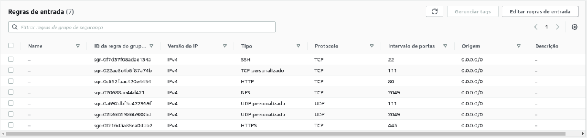
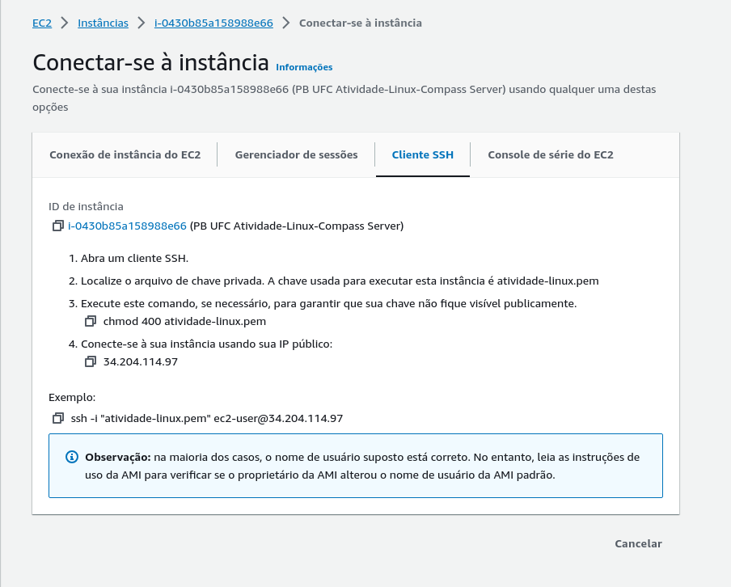
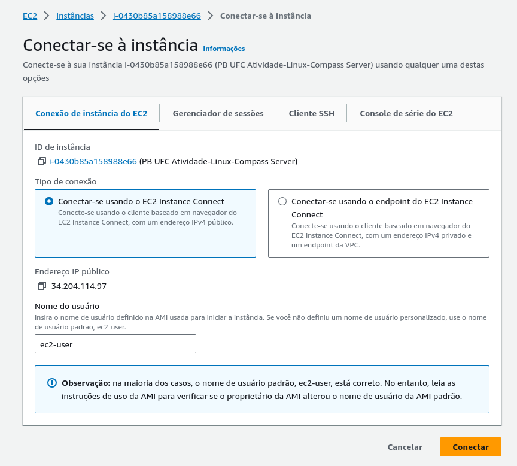
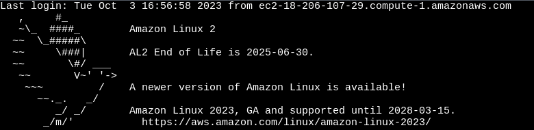
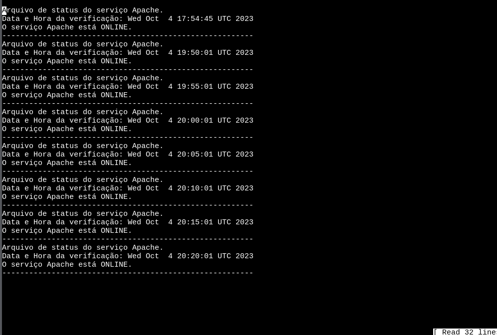
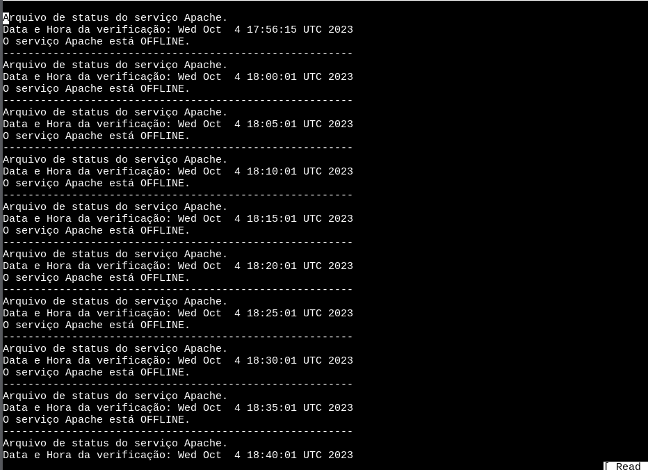

<h2>

Documentação da Atividade Linux - COMPASS.UOL

Autor: Alysson Alexandre de Oliveira Araújo

Cargo: Estagiário em devsecops/AWS

</h2>


#### Este documento tem como objetivo descrever passo a passo de como configurar um servidor contendo os serviços apache e NFS (Network File System) utilizando a AWS (Amazon Web Service), demonstrando as habilidades aprendidas durante os estudos sobre Linux.

<br>


1. Requisitos AWS
   
Antes de iniciar a configuração do servidor, vamos criar 2 instâncias na AWS EC2 onde uma será o servidor e a outra será o cliente na qual fará comunicações com o serviço do NFS provido pelo o servidor.
   

Para o servidor foi especificado que as configurações dessa instância EC2 tivesse as seguintes configurações:
- Sistema Operacional Amazon Linux 2;
- Tipo de instância t3.small
  - família de instâncias t3;
  - 2 vCPU;
  - 2 GiB de memória;
  - Sob demanda Linux base definição de preço: 0.0208 USD por hora(Preço pode variar de acordo com a região e data que este documento está sendo escrito);
- Foi exigido uma par de chaves (login) e ela foi criada e associada à esta instância EC2;
- O tamanho do armazenamento foi definido como 16 GiB SSD;
- A configuração do grupo de segurança foi definido para que a instância tivesse acesso a porta 22/TCP (SSH), 80/TCP (HTTP), 111/TCP e UDP, 2049/TCP/UDP (NFS) e 443/TCP (HTTPS) aberta para todos os endereços IPv4.
- 1 elastic IP para anexar à esta instância EC2.

<br>


Para o cliente não foi mencionado e nem pedido uma instância EC2 para esta atividade, porém, para fins demonstrar os serviços da instância do servidor, foi criado uma instância EC2 com as seguintes configurações:
- Sistema Operacional Amazon Linux 2;
- Tipo de instância t3.small
  - família de instâncias t3;
  - 2 vCPU;
  - 2 GiB de memória;
  - Sob demanda Linux base definição de preço: 0.0208 USD por hora (Preço pode variar de acordo com a região e data que este documento está sendo escrito);
- par de chaves (login);
    - OBS: A mesma chave utilizada na instância do servidor foi utilizada nesta instância EC2;
- O tamanho armazenamento foi definido como 16 GiB SSD;
- A configuração do grupo de segurança foi a padrão, onde a única porta aberta é a porta 22/TCP (SSH) aberta para todos os endereços IPv4;
- 1 elastic IP para anexar à esta instância EC2.

Imagem relacionado ao grupo de segurança da instância EC2 do servidor:



<br>

Em seguida vamos associar o elastic IP criado à instância EC2 do servidor. Para isso, vamos acessar o console da AWS EC2, selecionar a instância EC2 do servidor e clicar no botão "Ações" e selecionar a opção "Associar endereço IPv4 elástico". Em seguida, vamos selecionar a instância EC2 do servidor e clicar no botão "Associar". Também é preciso que a instância EC2 do cliente tenha um elastic IP associado à ela.

Agora vamos acessar a instância EC2 do cliente e vamos instalar o serviço do NFS. Para isso, vamos acessar a instância EC2 do cliente via SSH utilizando a chave criada e associada à esta instância EC2. Para isso, vamos utilizar o seguinte comando no terminal do Linux (esse comando é um exemplo):

1. Configuração do Servidor

Após a criação das instâncias EC2 e associar um elastic IP, vamos acessar a instância do servidor via SSH utilizando a chave criada e associada à esta instância EC2. Para isso, vamos utilizar o seguinte comando no terminal do Linux (esse comando é um exemplo):

```bash
ssh -i "nomedachave.pem" ec2-user@ipdainstanciaassociada
```

Também é possível acessar a instância EC2 através do console da AWS EC2, onde é possível acessar a instância EC2 através do botão "Conectar" e selecionar a opção "Acesso de cliente SSH" e copiar o comando que será utilizado para acessar a instância EC2 via SSH e ou escolher a opção "conexão de instância do EC2" dentro do próprio console. Segue as imagem abaixo:





Após estabelecer a conexão com ela, será exibida uma tela semelhante a esta:



Agora vamos instalar o serviço do apache e do NFS. Para isso, vamos utilizar os seguintes comandos:

```bash
sudo yum update -y
sudo yum install httpd -y
sudo yum install nfs-utils -y
```
Há a possibilidade de que já venha istalado o serviço do apache e do NFS. Porém, para garantir que estejam instalados, vamos executar os comandos acima.

Após a instalação, vamos iniciar a configuração do serviço do apache. Para isso, vamos executar os seguintes comandos:


```bash
sudo systemctl start httpd
sudo systemctl enable httpd
```
Descrevendo um pouco sobre o que cada comando faz:

- O comando **"sudo systemctl start httpd"** inicia o serviço do apache, onde o systemctl é um comando usado para interagir com o systemd, que é o sistema de inicialização do Linux.
- O comando **"sudo systemctl enable httpd"** habilita o serviço do apache para que ele sempre seja iniciado automaticamente todas as vezes que o servidor for inicializado.

Um comando extra que pode ser utilizado para verificar se httpd está ativo é o seguinte:

```bash
sudo systemctl status httpd
```
Após a execução desses comandos, vá no navegador e digite o endereço IP que foi associado na instância EC2 do servidor e verifique se a página do apache está sendo exibida. Segue a imagem abaixo:


1. Configuração do NFS

Agora vamos iniciar a configuração do NFS. Para isso, vamos criar uma pasta na raiz do sistema operacional do servidor. Para isso, vamos utilizar o seguinte comando:

```bash
sudo mkdir /var/nfs_share
```
Agora vamos configurar o arquivo **/etc/exports** para que o NFS compartilhe a pasta criada. Para isso, vamos utilizar o seguinte comando:

```bash
sudo vim /etc/exports
```
Dentro do arquivo **/etc/exports** vamos adicionar a seguinte linha:

```bash
/var/nfs_share <IpPublico>(rw,sync,no_root_squash,no_all_squash)
```

Onde:
- **/var/nfs_share** é o caminho da pasta que será compartilhada;
- No IpPublico vamos colocar o ip público da instância EC2 do cliente que 
  - Também é possível usar o * para que todos os ip's possam acessar a pasta compartilhada;
- **rw** significa que o cliente terá permissão de leitura e escrita;
- **sync** significa que o NFS vai aguardar a gravação de dados no disco antes de responder ao cliente;
- **no_root_squash** significa que o root do cliente terá as mesmas permissões do root do servidor;
- **no_all_squash** significa que todos os usuários do cliente terão as mesmas permissões do servidor. 


Após a configuração do arquivo **/etc/exports**, vamos reiniciar o serviço do NFS. Para isso, vamos utilizar o seguinte comando:

```bash
sudo systemctl restart nfs-server
```

Agora vamos configurar o firewall do Linux para que o serviço do NFS possa ser acessado. Para isso, vamos utilizar os seguintes comandos:

```bash
sudo firewall-cmd --permanent --add-service=nfs
sudo firewall-cmd --permanent --add-service=mountd
sudo firewall-cmd --permanent --add-service=rpc-bind
```

Basicamente, cada comando acima adiciona um serviço ao firewall do Linux. O primeiro comando adiciona o serviço do NFS, o segundo comando adiciona o serviço do mountd e o terceiro comando adiciona o serviço do rpc-bind. Após a execução desses comandos, vamos reiniciar o firewall do Linux. Para isso, vamos utilizar o seguinte comando:

```bash
sudo firewall-cmd --reload
```

Para que o serviço do NFS seja iniciado automaticamente todas as vezes que o servidor for inicializado, é utilizado o seguinte comando:

```bash
sudo systemctl enable nfs-server
```

Agora vamos verificar se o serviço do NFS está ativo. Para isso, vamos utilizar o seguinte comando:

```bash
sudo systemctl status nfs-server
```

Agora vamos verificar se o serviço do NFS está compartilhando a pasta criada. Para isso, vamos utilizar o seguinte comando:

```bash
sudo exportfs -v
```

Seguindo adiante, vamos acessar a instância EC2 do cliente via SSH utilizando a chave criada e associada à esta instância EC2. Para isso, vamos utilizar o seguinte comando no terminal do Linux (esse comando é um exemplo):

```bash
ssh -i "nomedachave.pem" ec2-user@ipdainstanciaassociada
```
Vale lembrar que é preciso que a instância EC2 do cliente tenha um elastic IP associado à ela e que é possível acessar o terminal da instância EC2 do cliente através do console da AWS EC2, como foi mostra anteriormente.

Após estabelecer a conexão com ela, será exibida a tela do terminal. A parti deste ponto, instalaremos o serviço do NFS. Para isso, vamos utilizar os seguintes comandos:

```bash
sudo yum update -y # Para atualizar os pacoetes do Linux
sudo yum install nfs-utils -y # Para instalar o serviço do NFS
```
Após a instalação, sé preciso criar um diretório onde será montado o compartilhamento do NFS. Para isso, o comando utilizado é:

```bash
sudo mkdir /mnt/nfs_share
```

Agora vamos montar o compartilhamento do NFS. Para isso, vamos utilizar o seguinte comando:

```bash
sudo mount -t nfs <IpPublicoDoServidor>:/var/nfs_share /mnt/nfs_share
```

Onde:
- **IpPublicoDoServidor** é o ip público da instância EC2 do servidor, no caso o elastic IP;
- **/var/nfs_share** é o caminho da pasta que será compartilhada;
- **/mnt/nfs_share** é o caminho da pasta onde será montado o compartilhamento do NFS.

Após a execução do comando acima, vamos verificar se o compartilhamento do NFS foi de fato montado. Para isso, vamos utilizar o seguinte comando:

```bash
df -h
```

Depois da montagem do compartilhamento do NFS, é possível criar e visualizar arquivos dentro da pasta **/mnt/nfs_share**.

Mesmo tendo feito a montagem do compatilhaento do NFS, é preciso que ele seja montado automaticamente todas as vezes que o cliente for inicializado. Para isso, é preciso seguir os seguintes passos:

1. Primeiro é necessário acessar o arquivo **/etc/fstab**. Para isso, vamos utilizar o seguinte comando:


```bash
sudo vim /etc/fstab
```
* OBS: pode ser usado outro editor de texto como o nano, por exemplo.

2. Dentro do arquivo **/etc/fstab** vamos adicionar a seguinte linha:

```bash
<IpPublicoDoServidor>:/var/nfs_share /mnt/nfs_share nfs defaults 0 0
```
Informações sobre o que são os valores "defaults 0 0":

- **defaults**: O valor "defaults" é um conjunto de opções de montagem padrão que inclui rw, suid, dev, exec, auto, nouser e async. Essas opções são usadas para montar o sistema de arquivos com as configurações padrão.

- Opções de Montagem (Primeiro "0"): O primeiro valor, que é um "0" na maioria dos casos, define as opções de montagem para o sistema de arquivos. Essas opções podem incluir permissões, opções de leitura/escrita, montagem somente leitura e outras configurações específicas do sistema de arquivos.

- Verificação Automática (Segundo "0"): O segundo valor, que também é um "0", controla a verificação automática do sistema de arquivos durante a inicialização do sistema. Ele está relacionado à ferramenta fsck (File System Consistency Check), que verifica a integridade do sistema de arquivos. O valor "0" indica que nenhum teste automático deve ser realizado durante a inicialização. Se você quiser que o sistema de arquivos seja verificado automaticamente durante a inicialização, você pode definir esse valor para "1" ou outro número correspondente ao teste de verificação automática.

Após a adição da linha, vamos salvar o arquivo e reiniciar o cliente. Se tudo certo, o compartilhamento do NFS será montado automaticamente todas as vezes que o cliente for inicializado.


3. Verificaação do status do servidor Apache

Depois de concluir a configuração do cliente, voltamos para o servidor para criarmos um script que verifica o status do servidor Apache. Primeiro vamos criar um diretório onde ficará o script. O diretório comum para scripts é o **/etc/scripts**. Para isso, vamos utilizar o seguinte comando:

```bash
sudo mkdir /etc/scripts
```
Dentro desse diretório vamos criar um script chamado **script_verify_status_server.sh. Nele, vamos usar o *systemctl* para verificar o status do servidor Apache.

```bash
!/bin/bash

# Nome do serviço
SERVICE_NAME="Apache"

# Data e horário da execução da verificação de status
DATE=$(date)

# Aqui faz uma verificação para saber se o serviço Apache está online
if systemctl is-active --quiet httpd; then
    SERVICE_STATUS_APACHE="ONLINE"
    OUTPUT_FILE="/var/nfs_share/alysson_araujo/validation_online.log"
else
    SERVICE_STATUS_APACHE="OFFLINE"
    OUTPUT_FILE="/var/nfs_share/alysson_araujo/validation_offline.log"
fi

# Escreve essas informações no arquivo
echo "Arquivo de status do serviço $SERVICE_NAME." >> $OUTPUT_FILE
echo "Data e Hora da verificação: $DATE" >> $OUTPUT_FILE
echo "O serviço $SERVICE_NAME está $SERVICE_STATUS_APACHE." >> $OUTPUT_FILE
echo "--------------------------------------------------------" >> $OUTPUT_FILE
```
De forma resumida, o script verifica se o serviço do Apache está ativo. Se estiver ativo, ele escreve no arquivo **validation_online.log** que o serviço está online. Se estiver inativo, ele escreve no arquivo **validation_offline.log** que o serviço está offline. Além disso, ele escreve a data e horário da execução da verificação de status.

Exemplo do arquivo **validation_online.log**:



Exemplo do arquivo **validation_offline.log**:


Dado um dos requisitos seria necessidade de que o script fosse executado a cada 5 minutos, a forma de configurar isso é através do crontab. 

Explicando de uma forma mais básica, o crontab é um arquivo onde nele possui uma lista de comandos que são executados pelo cron. O cron é um serviço do Linux que executa comandos de acordo um tempo especificado nos comandos dentro do crontab. É utilizado o comando **crontab -e** para editar o arquivo crontab.


```bash
crontab -e
```

Dentro do arquivo crontab, vamos adicionar a seguinte linha:

```bash
*/5 * * * * /etc/scripts/script_verify_status_server.sh
```
A configuração feita pelo comando acima é que a cada 5 minutos o script **script_verify_status_server.sh** será executado. Após a adição desse comando, é preciso salvar o arquivo e reiniciar o serviço do cron. Para isso, vamos utilizar os seguintes comandos:

```bash
sudo systemctl restart crond
sudo systemctl enable crond
```
Se tudo ocorrer da forma prevista, o script será executado a cada 5 minutos e os arquivos **validation_online.log** e **validation_offline.log** serão criados na pasta **/var/nfs_share**.
